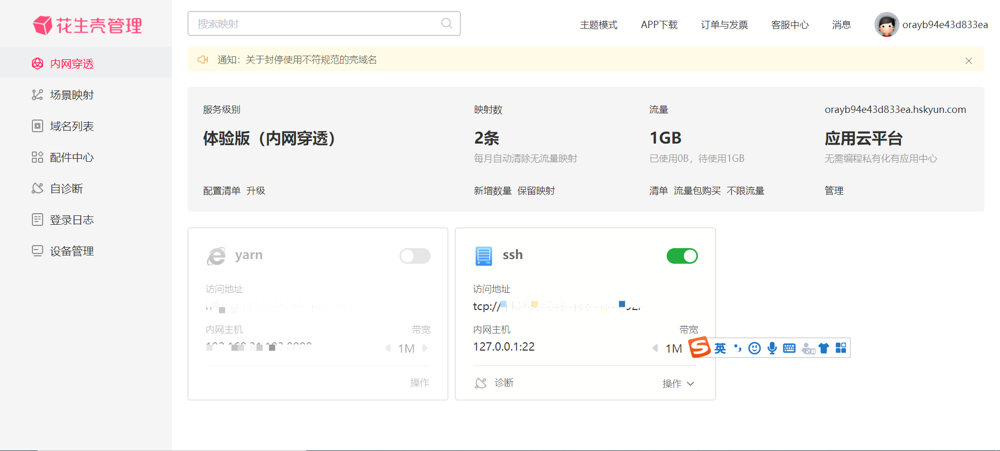
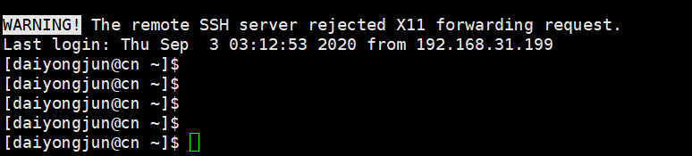
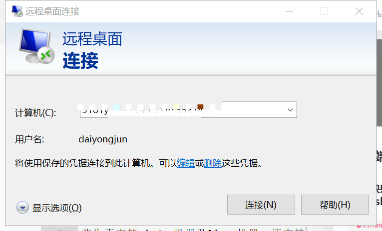

#### 提要
目前主流的云服务器很多，可是我自己的服务在好久之前就已经到期，想续费看到动不动一年好几千块，想想还是算了，正好自己家里也有闲置的电脑不使用，于是就想将它变成云服务。

#### 软件安装
```
> /opt/package
> wget https://dl-cdn.oray.com/hsk/linux/phddns-5.0.0.x86_64.rpm
>  sudo rpm -ivh phddns-5.0.0.x86_64.rpm
+----------------Phtunnel start install--------------+

Updating / installing...
   1:phddns-5.0.0-1                   ################################# [100%]
Created symlink from /etc/systemd/system/multi-user.target.wants/phtunnel.service to /usr/lib/systemd/system/phtunnel.service.

+-----------Phtunnel Service Install Success---------+


+--------------------------------------------------------+
|                Oray Phtunnel Linux 5.0.0               |
+--------------------------------------------------------+
|     SN: orayb94e43d833ea   Default password: admin     |
+--------------------------------------------------------+
| Usage: phddns(start|status|stop|restart|reset|version) |
+--------------------------------------------------------+
|       Remote Management Address http://b.oray.com      |
+--------------------------------------------------------+
> sudo phddns start
phtunnel service start success !
> sudo phddns status
 +--------------------------------------------------+
 |          Oray PeanutHull Linux 5.0.0             |
 +--------------------------------------------------+
 |              Runstatus: ONLINE                   |
 +--------------------------------------------------+
 |              SN: xxxxxxxxxxxxxx             |
 +--------------------------------------------------+
 |    Remote Management Address http://b.oray.com   |
 +--------------------------------------------------+

```

#### 账号绑定
##### 在浏览器输入下面提供的地址,并使用安装时提供的账户和密码
```
+--------------------------------------------------------+
|                Oray Phtunnel Linux 5.0.0               |
+--------------------------------------------------------+
|     SN: orayb94e43d833ea   Default password: admin     |
+--------------------------------------------------------+
| Usage: phddns(start|status|stop|restart|reset|version) |
+--------------------------------------------------------+
|       Remote Management Address http://b.oray.com      |
+--------------------------------------------------------+
```


##### 注册账号【你需要用你的手机号申请】


##### 绑定账号【绑定结束，提示激活成功】


#### 绑定端口
##### 端口映射【http需要协议你需要花6元购买,我们只配置ssh使用tcp协议即可】



##### 使用xshell远程登录



#### 扩展【花生壳支持windows机器,可以使用远程桌面,扩展你的机器】



#### 引用相关文章
>[官方安装文档](http://service.oray.com/question/4287.html "官方安装文档")
