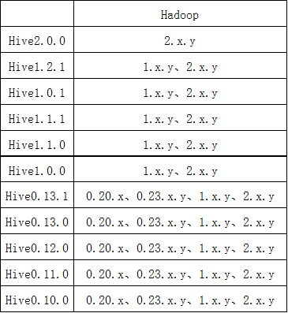

>[cnblogs : Hive的mysql安装配置](https://www.cnblogs.com/rmxd/p/11318609.html "Hive的mysql安装配置")


#### 英语生词

- scheduler	美[ˈskɛdʒʊlər]
n.	调度程序，日程安排程序;

#### 如何启动
本文本建立在MapReduce的章节之上

[下载hive-1.2.1版本](http://archive.apache.org/dist/hive/hive-1.2.1/apache-hive-1.2.1-bin.tar.gz "下载hive-1.2.1版本")

#### 介绍
下载hive-1.2.x以后的版本支持UNION等语法。其次hive-1.2.x版本与hadoop2.5.x版本相互兼容




#### 启动HIVE
```
> cd /opt/package
> tar -xzvf apache-hive-1.2.1-bin.tar.gz -C /opt/software/
> sudo vi /etc/profile
HIVE_HOME = /opt/software/apache-hive-1.2.1-bin
PATH = $PATH:$HIVE_HOME/bin

> cd /opt/software/apache-hive-1.2.1-bin/conf
> mv hive-env.sh.template hive-env.sh
> vi hive-env.sh
HADOOP_HOME=${HADOOP_HOME}

#在HDFS中创建HIVE数据存储路径
> hdfs dfs -mkdir -p /user/hive/warehouse
> hdfs dfs -mkdir -p /tmp
> hdfs dfs -chmod -R g+w /user/hive/warehouse
> hdfs dfs -chmod -R g+w /tmp

> hive
[ERROR] Terminal initialization failed; falling back to unsupported
#参考网上解决版本【方法已在文章开头，切换hive高版本的包到hadoop的依赖包中】
cp /opt/software/apache-hive-1.2.1-bin/lib/jline-2.12.jar /opt/software/hadoop-2.5.0-cdh5.3.6/share/hadoop/yarn/lib/
#重新启动
> hive
Logging initialized using configuration in jar:file:/opt/software/apache-hive-1.2.1-bin/lib/hive-common-1.2.1.jar!/hive-log4j.properties
hive>
#退出
ctrl+c
```
    
##### 执行一个简单HIVE任务
**29822_0_0.csv**
```
"唯一索引",标题
257200a371f6268283ee85792c8d58e1,江心这片“空军蓝”格外耀眼
4ef22236dca93ff1f38801b943016e35,抗洪救援！“太保服务”逆水而行
b946eb16dd0ad3388541f9012fbc9348,防汛抗洪！铜陵公安出动警力6000余次、转移疏散群众2000余人
39ae63946f241121f1bfb1395c3f2518,美好家园新未来
9842b0df9ada1b81a549347b31311079,八一節｜抗洪24小時
7cac89915a931a52635d3600f03c4e17,消防急救受困男子
784e8d10c3f0b6cbfd1632971b855565,美好家园新未来
e4cb668d30803df262a2e7fd3897f36e,国家防总将防汛Ⅱ级应急响应调整至Ⅲ级
fa7e903b870d2e76ea1189d6e1cf3733,在抗疫前线的德国国防军，人手一张“生死牌”
aca623d892f4b09353df9a1ca0177167,8月四川主要江河发生超警洪水的概率较小
16463c80bfbdc73dde7d47d40b00ef85,一桶水的高度 一座城的决战
```
**29823_0_0.csv**
```
"唯一索引",标题
257200a371f6268283ee85792c8d58e1,江心这片“空军蓝”格外耀眼
4ef22236dca93ff1f38801b943016e35,抗洪救援！“太保服务”逆水而行
b946eb16dd0ad3388541f9012fbc9348,防汛抗洪！铜陵公安出动警力6000余次、转移疏散群众2000余人
```

```
#创建CSV文件
> mkdir /opt/document/29822_0_0.csv
> mkdir /opt/document/29823_0_0.csv

> hive 
Logging initialized using configuration in jar:file:/opt/software/apache-hive-1.2.1-bin/lib/hive-common-1.2.1.jar!/hive-log4j.properties
hive> create database hive ;
hive> use hive ;
hive> create table news_29822(id String ,title string) ROW FORMAT DELIMITED FIELDS TERMINATED BY ',' STORED AS TEXTFILE;
hive> create table news_29823(id String ,title string) ROW FORMAT DELIMITED FIELDS TERMINATED BY ',' STORED AS TEXTFILE;
hive> load data local inpath '/opt/document/29822_0_0.csv'  into table news_29822;
hive> load data local inpath '/opt/document/29823_0_0.csv'  into table news_29823;

hive> select * from news_29823 union select * from news_29822;
"唯一索引"	标题
16463c80bfbdc73dde7d47d40b00ef85	一桶水的高度 一座城的决战
bcc78bb86021dc296926cfcb62938cd1	我县组织部署动员防汛演练，确保全县群众安全度汛
a0a939523d6f1fa3d821b79c5ead2fda	日本|日本传出坏消息，连五角大楼都坐不住了，驻日美军或准备全部撤离！
3f24a9a8126cca3a94a1898a5462e500	欢迎访问浙江省红十字会网站
f78380036e926cc65e434a47eb1c5b82	【限时特惠】平湖乍浦当代和山悦楼盘信息——平湖铅山头条
7a66fced9d260a75cce0ce659301776c	疯涨的粮价依然“撬不开”农民的粮库，农民为何惜售？答案揭晓！
41522caea1661a43cca6d898ef4a60c6	中国制造业持续改善 消费品和新动能行业增长较快
04b433d173aa60dfe235cc81dd9b246c	中国制造业持续改善 消费品和新动能行业增长较快
8b923a0a3fd794c01b94c91a82ab2292	洪水回落速度加快，石首至高基庙道路旁边……
Time taken: 0.708 seconds, Fetched: 10 row(s)

```
##### 问题描述
Hive的数据，是存在HDFS里的。此外，hive有哪些数据库，每个数据库有哪些表，这样的信息称之为hive的元数据信息。元数据信息不存在HDFS，而是存在关系型数据库里，hive默认用的是derby数据库来存储。但是derby有一个问题，会在启动时的当前目录创建metastore.db目录来本地化数据库数据，当切换目录则读取不到先前的数据。可以试着切换。

##### 验证描述内容
```
> cd /opt/software/apache-hive-1.2.1-bin/lib
> ll | grep metastore
#存在描述中metastore_db目录
drwxrwxr-x.  5 daiyongjun daiyongjun      133 8月   4 16:29 metastore_db
> hive
hive> show databases;
OK
default
hive
Time taken: 9.551 seconds, Fetched: 2 row(s)
#退出
hive> ctrl+c
#切换目录
> cd ../
> hive
hive> show databases;
#和描述内容吻合，我们找不到hive的database;
OK
default
Time taken: 8.496 seconds, Fetched: 1 row(s)
```

##### 如何解决呢？
hive默认用的是derby数据库来存储。我们将derby更换成mysql存储hive的元数据。

###### 安装mysql
跳转linux如何安装mysql

###### 更换hive默认数据库
```
#删除derby数据库和删除hdfs中的原始数据
> cd /opt/software/apache-hive-1.2.1-bin/lib
> rm -rf metastore_db
> rm -rf derby.log
#删除hdfs中的原始数据
hadoop fs -rm -r /user/hive

#链接【永久有效】：https://pan.baidu.com/s/1UdgG8Bp8rjYpMYSapZt80A    提取码：ty21
> cd /opt/package
> rz mysql-connector-java-5.1.27.tar.gz
> tar -zxvf mysql-connector-java-5.1.27.tar.gz -C ../software/
> cd ../software/mysql-connector-java-5.1.27   
> mv mysql-connector-java-5.1.27-bin.jar ../apache-hive-1.2.1-bin/lib/

#修改配置
> cd ../apache-hive-1.2.1-bin/conf
> vi hive-site.xml
<configuration>
	<property>
		<name>javax.jdo.option.ConnectionURL</name>
		<value>jdbc:mysql://master:3306/metastore?createDatabaseIfNotExist=true</value>
		<description>JDBC connect string for a JDBC metastore</description>
	</property>

	<property>
		<name>javax.jdo.option.ConnectionDriverName</name>
		<value>com.mysql.jdbc.Driver</value>
		<description>Driver class name for a JDBC metastore</description>
	</property>
	
	<property>
		<name>javax.jdo.option.ConnectionUserName</name>
		<value>root</value>
		<description>username to use against metastore database</description>
	</property>

	<property>
		<name>javax.jdo.option.ConnectionPassword</name>
		<value>1qaz2wsx</value>
		<description>password to use against metastore database</description>
	</property>
</configuration>

> mv hive-log4j.properties.template hive-log4j.properties
> vi hive-log4j.properties
#修改
hive.log.dir=/opt/software/apache-hive-1.2.1-bin/logs

> hive
Logging initialized using configuration in file:/opt/software/apache-hive-1.2.1-bin/conf/hive-log4j.properties
hive> show databases;
#重新执行一个简单HIVE任务
```

#### 开启HIVE远程访问
```
> vi hive-site.xml
	<property>
		<name>hive.metastore.schema.verification</name>
		<value>false</value>
	</property>
	<property> 
		<name>hive.cli.print.current.db</name>
		<value>true</value>
	</property>
	<property> 
		<name>hive.cli.print.header</name>
		<value>true</value>
	</property>

	<!-- 这是hiveserver2 -->
	<property>
		<name>hive.server2.thrift.port</name>
		<value>10000</value>
	</property>
	<property>
		<name>hive.server2.thrift.bind.host</name>
		<value>127.0.0.1</value>
	</property>
> hive --service metastore &
> hive --service hiveserver2 &
> beeline
beeline> !connect jdbc:hive2://127.0.0.1:10000
```